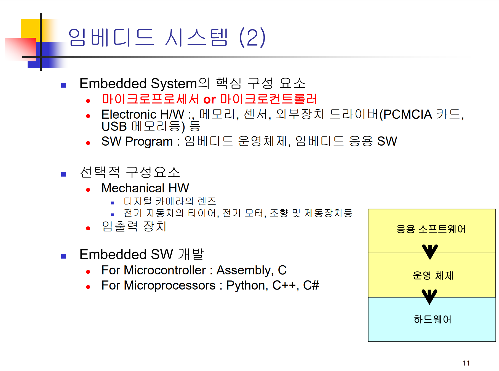

# [임베디드SW] 1. 임베디드 시스템이란?

<aside>

# 💖 임베디드 시스템이란?

</aside>

핵심은 `마이크로 프로세서`. 그 시스템만을 위한 CPU를 이용해 어떻게 프로그래밍할지를 배우는 과목인 것 같다. 또 특히 임베디드 소프트웨어를 개발할 때는 특히 입출력장치를 비롯한 하드웨어를 다룰 일이 많다고 한다.

## 마이크로 프로세서 vs 마이크로 컨트롤러

### 마이크로 프로세서

상대적으로 복잡함

### 마이크로 컨트롤러

상대적으로 구조가 간단함. 따라서 Assembly language나 C language를 이용하여 개발

임베디드 시스템은 **대개 특정한 요구사항이 있는 경우**가 많다고 한다. 핸들을 다뤄야 한다든가, 휴대 가능해야한다든가 하는,,,

 

# 임베디드 시스템의 활용 분야

별로 중요한 내용은 딱히 아닌 듯,,,

요즘은 **여러 개의 임베디드 시스템들이 이렇게 합쳐지는 추세**라고 한다

# 임베디드 시스템 구성

## X-platfrom과 X-compiler(크로스 컴파일러)

**개발 환경 OS에서 컴파일해도 다른 OS에서 돌아가게 하는 것**. 예를 들어 Linux에서 X compiler를 이용해 컴파일을 진행하면 binary로 compile했을 때 window 환경에서도 그 프로그램을 돌릴 수 있다.

위 도식처럼 임베디드 SW를 개발할 때는 **개발하는 OS와 target의 OS가 다른 경우가 대부분**이다.

특히 임베디드 시스템 개발에서는 하드웨어 개발과 OS 개발, SW 개발이 유기적으로 결합되어 서로 피드백을 주고받는다는 특징이 있다.