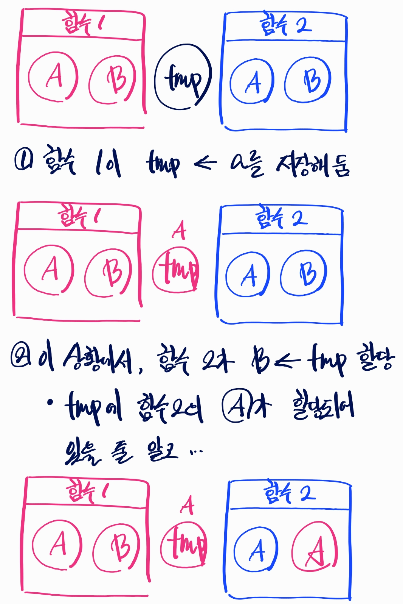

# [임베디드SW] 7. Reentrancy Code

<aside>

# 💖 OS: Reentrancy code

</aside>

<aside>

**reentrancy** 

재진입 가능성. 어떤 함수가 reentrant하다면, **여러 개의 task가 동시에 그 함수를 실행해도 문제가 없다**는 것이다

</aside>

## 함수를 Reentrantive하게 만들려면 어떻게 해야 하나요?

1. **전역변수를 사용해서는 안됩니다**
    1. 전역변수는 shared resource이기 때문입니다.
2. 전역변수 대신 semaphore를 사용합니다
3. **동일 우선 순위를 갖는 task에서 round-robin을 하지 않습니다**

## 재진입 불가능 함수는 왜 문제가 생기나요?

### 재진입 가능 함수

```c
void swap(int* x, int* y){
	int temp;
	temp = *x;
	*x = *y;
	*y = temp;
}
```

### 재진입 불가능 함수

```c
int temp;
void swap(int* x, int* y){
	temp = *x;
	*x = *y;
	*y = temp;
}
```



- 두 개의 다른 함수에서 동시에 ①`swap(a, b)`와 ②`swap(c, d)`를 실행했다고 하자.
    - thread가 두 개로 나뉘어서 swap()을 각각 실행한다
        - task 두 개가 동시에 실행되는 상황
    - ①`swap(a, b)`이 실행됐을 때
        - `temp = *x;`를 실행한 직후에 바로
    - ②`swap(c, d)`가 실행됐다면?
        - `temp = *x;` 를 실행. temp == c로 덮어써진다.
    - 이 상황에서  ①`swap(a, b)`가 `temp = *x;` 를 수행한다면?
        - 이미 temp == c가 되어 있다.
        - **원래는 x ==  a가 되어야 하지만,  temp == c이므로 x == c가 되어버린다…!!**